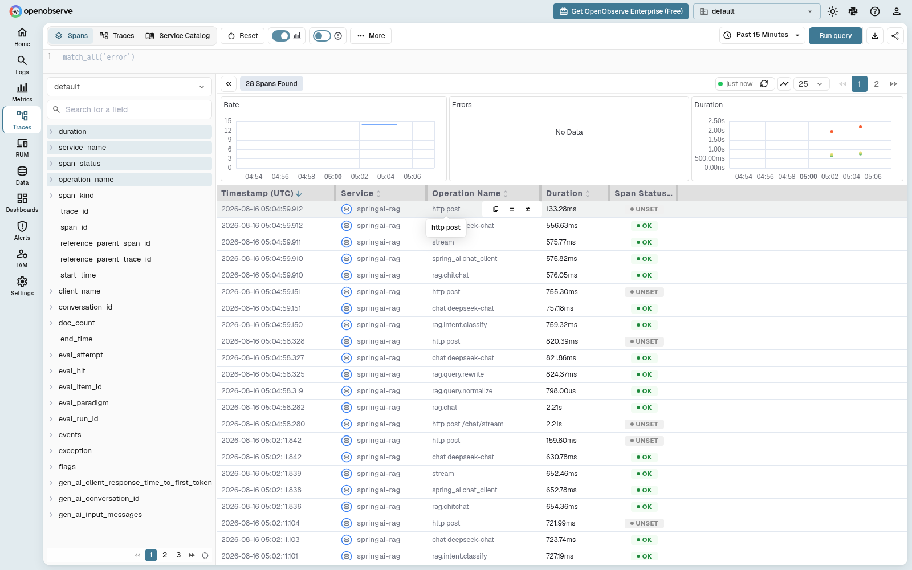
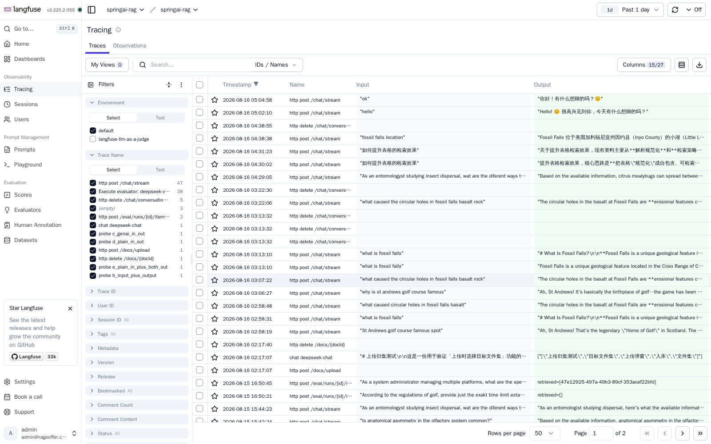
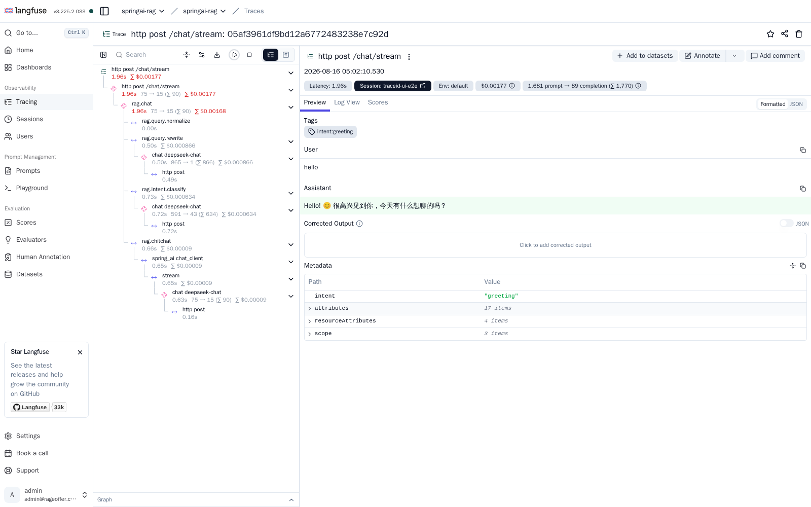

# llm-observability

面向 LLM / RAG 应用的 Spring Boot 可观测组件，基于 **Micrometer Observation + OpenTelemetry**：

- 步骤级 span（`@TelemetryStep`）与会话级 trace（`@TelemetryConversation`）
- 结构化事件日志（`TelemetryLogger` / `TelemetryStructuredLog`）
- 统一事件管线（processor 摘要/截断 + exporter 落 span/日志/指标）
- 事件过滤器链（Spring 风格 SPI：宿主实现 `TelemetryFilter`，覆盖事件/结构化日志/普通日志全生命周期）
- 框架无关的 LLM 观测规范（`LlmObservations` / `LlmTraceHandler`，写标准 `gen_ai.*` 语义）
- 属性 key 单一来源（`AttributeKeys`），业务零字面量
- 后端可插拔：`llm-observability-backends` 提供 OpenObserve / Langfuse 适配

核心原则：**业务只面向 OTel / Micrometer 写通用语义，后端可插拔**。

## 效果展示

OpenObserve Traces（span 列表、耗时、状态与 `gen_ai.*` 属性）：



Langfuse Traces（trace 列表）：



Langfuse 单条 trace 详情（输入/输出、token 用量、耗时）：



## 模块

| 模块 | 说明 |
|---|---|
| `llm-observability` | 核心 starter（步骤/会话/LLM 观测、事件管线、跨线程传播） |
| `llm-observability-backends` | OpenObserve / Langfuse 配置、直连 OTLP exporter、属性映射、读取/编排客户端 |
| `llm-observability-examples` | 后端客户端接口使用示例（可编译、可运行只读演示） |

## 要求

- JDK 17+
- Spring Boot 3.5.x

## 快速开始

```xml
<dependency>
    <groupId>com.jjx.ai</groupId>
    <artifactId>llm-observability</artifactId>
    <version>0.1.0-SNAPSHOT</version>
</dependency>
```

引入后自动装配生效；业务用 `TelemetryTemplate` 开 span、记 IO，或直接加注解：

```java
@TelemetryStep("rag.retrieve")
public List<Chunk> retrieve(String query) { ... }
```

后端适配按需引入 `llm-observability-backends`，配置前缀统一为 `telemetry.*`。

## 发布与使用

当前坐标 `com.jjx.ai:llm-observability:0.1.0-SNAPSHOT` 是本地快照；要变成其它项目可直接拉取的“真依赖”，
发布到 GitHub Packages 即可（根 POM 已配置好 `distributionManagement`）：

```powershell
$env:GITHUB_TOKEN = "你的 token"
mvn deploy
```

完整步骤（Token 生成、Maven settings 配置、消费方仓库声明）见 [doc/publish-github-packages.md](doc/publish-github-packages.md)。

## 构建

```bash
mvn -B package
```

详细使用说明见各模块 README 与 [doc/README.md](doc/README.md)（含核心模块 README 副本、效果图与截图脚本）。
